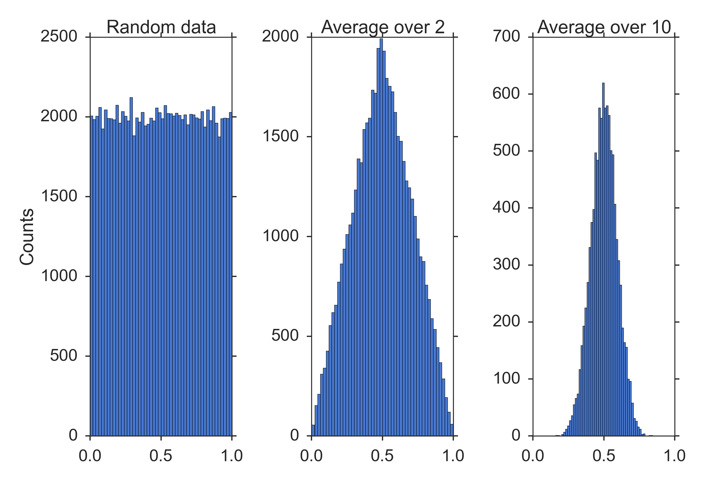

[](https://github.com/thomas-haslwanter/statsintro_python)

## [](http://quantlet.de/) **ISP_centralLimitTheorem** [](http://quantlet.de/d3/ia)


```yaml
Name of QuantLet: ISP_centralLimitTheorem

Published in:  An Introduction to Statistics with Python

Description: Practical demonstration of the *central limit theorem*, based on the uniform distribution

Keywords: CLT, normal-distribution, normal approximation, simulation, uniform, distribution

See also: ISP_binomialTest, ISP_distContinuous, ISP_distDiscrete, ISP_distNormal

Author: Thomas Haslwanter

Submitted: October 31, 2015

Example: CentralLimitTheorem.png

```





```py
''' Practical demonstration of the central limit theorem, based on the uniform distribution '''

# Copyright(c) 2015, Thomas Haslwanter. All rights reserved, under the CC BY-SA 4.0 International License

# Import standard packages
import numpy as np
import matplotlib.pyplot as plt
import seaborn as sns
import os

# additional packages
import sys
sys.path.append(os.path.join('..', '..', 'Utilities'))

try:
# Import formatting commands if directory "Utilities" is available
    from ISP_mystyle import setFonts, showData 
    
except ImportError:
# Ensure correct performance otherwise
    def setFonts(*options):
        return
    def showData(*options):
        plt.show()
        return

# Formatting options
sns.set(context='poster', style='ticks', palette='muted')

# Input data
ndata = 100000
nbins = 50

def showAsHistogram(axis, data, title):
    '''Subroutine showing a histogram and formatting it'''
    
    axis.hist( data, bins=nbins)
    axis.set_xticks([0, 0.5, 1])
    axis.set_title(title)

def main():
    '''Demonstrate central limit theorem.'''
    
    setFonts(24)
    # Generate data
    data = np.random.random(ndata)
    
    # Show three histograms, side-by-side
    fig, axs = plt.subplots(1,3)
    
    showAsHistogram(axs[0], data, 'Random data')
    showAsHistogram(axs[1], np.mean(data.reshape((ndata//2, 2 )), axis=1), 'Average over 2')
    showAsHistogram(axs[2], np.mean(data.reshape((ndata//10,10)), axis=1), 'Average over 10')
    
    # Format them and show them
    axs[0].set_ylabel('Counts')
    plt.tight_layout()
    showData('CentralLimitTheorem.png')
    
if __name__ == '__main__':
   main() 
