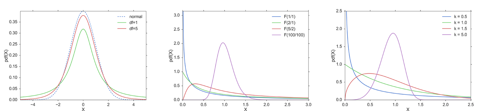

[](https://github.com/thomas-haslwanter/statsintro_python)

## [](http://quantlet.de/) **ISP_distContinuous** [](http://quantlet.de/d3/ia)


```yaml
Name of QuantLet: ISP_distContinuous

Published in:  An Introduction to Statistics with Python

Description: 'Plots of different continuous distribution functions.
    - T-distribution
    - F-distribution
    - Chi2-distribution
    - Exponential
    - Weibull'

Keywords: visualization, plot, t-distribution, f-distribution, chi2-distribution, weibull distribution

See also: ISP_binomialTest, ISP_centralLimitTheorem, ISP_distDiscrete, ISP_distNormal

Author: Thomas Haslwanter 

Submitted: October 31, 2015 

Example:  dist_t.png, dist_chi2.png, dist_f.png, dist_exp.png, Weibull_PDF.png
```





```py
''' Different continuous distribution functions.
- T-distribution
- F-distribution
- Chi2-distribution
- Exponential
- Weibull
'''

# Copyright(c) 2015, Thomas Haslwanter. All rights reserved, under the CC BY-SA 4.0 International License

# Import standard packages
import numpy as np
import matplotlib.pyplot as plt
from scipy import stats
import seaborn as sns
import os

# additional packages
from matplotlib.mlab import frange
import sys
sys.path.append(os.path.join('..', '..', 'Utilities'))

try:
# Import formatting commands if directory "Utilities" is available
    from ISP_mystyle import showData 
    
except ImportError:
# Ensure correct performance otherwise
    def showData(*options):
        plt.show()
        return

sns.set(context='poster', style='ticks', palette='muted', font_scale=1.5)

#----------------------------------------------------------------------
def showT():
    '''Utility function to show T distributions'''
    
    t = frange(-5, 5, 0.05)
    TVals = [1,5]
    
    normal = stats.norm.pdf(t)
    t1 = stats.t.pdf(t,1)
    t5 = stats.t.pdf(t,5)
    
    plt.plot(t,normal, '--',  label='normal')
    plt.plot(t, t1, label='df=1')
    plt.plot(t, t5, label='df=5')
    plt.legend()
        
    plt.xlim(-5,5)
    plt.xlabel('X')
    plt.ylabel('pdf(X)')
    plt.axis('tight')
    
    outFile = 'dist_t.png'
    showData(outFile)
    
#----------------------------------------------------------------------
def showChi2():
    '''Utility function to show Chi2 distributions'''
    
    t = frange(0, 8, 0.05)
    Chi2Vals = [1,2,3,5]
    
    for chi2 in Chi2Vals:
        plt.plot(t, stats.chi2.pdf(t, chi2), label='k={0}'.format(chi2))
    plt.legend()
        
    plt.xlim(0,8)
    plt.xlabel('X')
    plt.ylabel('pdf(X)')
    plt.axis('tight')
    
    outFile = 'dist_chi2.png'
    showData(outFile)
    
#----------------------------------------------------------------------
def showF():
    '''Utility function to show F distributions'''
    
    t = frange(0, 3, 0.01)
    d1s = [1,2,5,100]
    d2s = [1,1,2,100]
    
    for (d1,d2) in zip(d1s,d2s):
        plt.plot(t, stats.f.pdf(t, d1, d2), label='F({0}/{1})'.format(d1,d2))
    plt.legend()
        
    plt.xlim(0,3)
    plt.xlabel('X')
    plt.ylabel('pdf(X)')
    plt.axis('tight')
    plt.legend()
        
    outFile = 'dist_f.png'
    showData(outFile)

#----------------------------------------------------------------------
def showExp():
    '''Utility function to show exponential distributions'''
    
    t = frange(0, 3, 0.01)
    lambdas = [0.5, 1, 1.5]
    
    for par in lambdas:
        plt.plot(t, stats.expon.pdf(t, 0, par), label='$\lambda={0:3.1f}$'.format(par))
    plt.legend()
        
    plt.xlim(0,3)
    plt.xlabel('X')
    plt.ylabel('pdf(X)')
    plt.axis('tight')
    plt.legend()
        
    outFile = 'dist_exp.png'
    showData(outFile)
    
#----------------------------------------------------------------------
def showWeibull():
    '''Utility function to show Weibull distributions'''
    
    t = frange(0, 2.5, 0.01)
    lambdaVal = 1
    ks = [0.5, 1, 1.5, 5]
    
    for k in ks:
        wd = stats.weibull_min(k)
        plt.plot(t, wd.pdf(t), label='k = {0:.1f}'.format(k))
        
    plt.xlim(0,2.5)
    plt.ylim(0,2.5)
    plt.xlabel('X')
    plt.ylabel('pdf(X)')
    plt.legend()
        
    outFile = 'Weibull_PDF.png'
    showData(outFile)
    
#----------------------------------------------------------------------
if __name__ == '__main__':
    showT()
    showChi2()
    showF()
    showExp()
    showWeibull()
```
