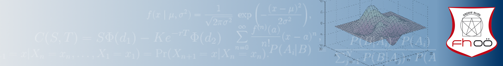
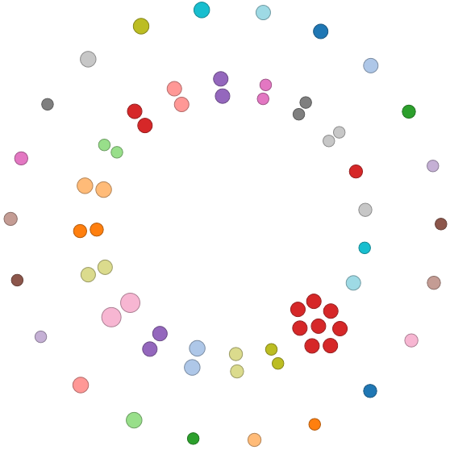

[](https://github.com/thomas-haslwanter/statsintro_python)

## [](http://quantlet.de/) **ISP_sampleSize** [](http://quantlet.de/d3/ia)


```yaml
Name of QuantLet: ISP_sampleSize

Published in:  An Introduction to Statistics with Python

Description: 'Calculate the sample size for experiments, for normally distributed groups, for:
    - Experiments with one single group
    - Comparing two groups'

Keywords: sample size

See also: ISP_checkNormality 

Author: Thomas Haslwanter 

Submitted: October 31, 2015 
```

```py
'''Calculate the sample size for experiments, for normally distributed groups, for:
- Experiments with one single group
- Comparing two groups
'''

# Copyright(c) 2015, Thomas Haslwanter. All rights reserved, under the CC BY-SA 4.0 International License

# Import standard packages
import numpy as np

# additional packages
from scipy.stats import norm

def sampleSize_oneGroup(d, alpha=0.05, beta=0.2, sigma=1):
    '''Sample size for a single group. The formula corresponds to Eq 6.2 in the book.'''
    
    n = np.round((norm.ppf(1-alpha/2.) + norm.ppf(1-beta))**2 * sigma**2 / d**2)
    
    print(('In order to detect a change of {0} in a group with an SD of {1},'.format(d, sigma)))
    print(('with significance {0} and test-power {1}, you need at least {2:d} subjects.'.format(alpha, 100*(1-beta), int(n))))
    
    return n

def sampleSize_twoGroups(D, alpha=0.05, beta=0.2, sigma1=1, sigma2=1):
    '''Sample size for two groups. The formula corresponds to Eq 6.4 in the book.'''
    
    n = np.round((norm.ppf(1-alpha/2.) + norm.ppf(1-beta))**2 * (sigma1**2 + sigma2**2) / D**2)
    
    print(('In order to detect a change of {0} between groups with an SD of {1} and {2},'.format(D, sigma1, sigma2)))
    print(('with significance {0} and test-power {1}, you need in each group at least {2:d} subjects.'.format(alpha, 100*(1-beta), int(n))))
    
    return n

if __name__ == '__main__':
    sampleSize_oneGroup(0.5)
    print('\n')
    sampleSize_twoGroups(0.4, sigma1=0.6, sigma2=0.6)
    
```
