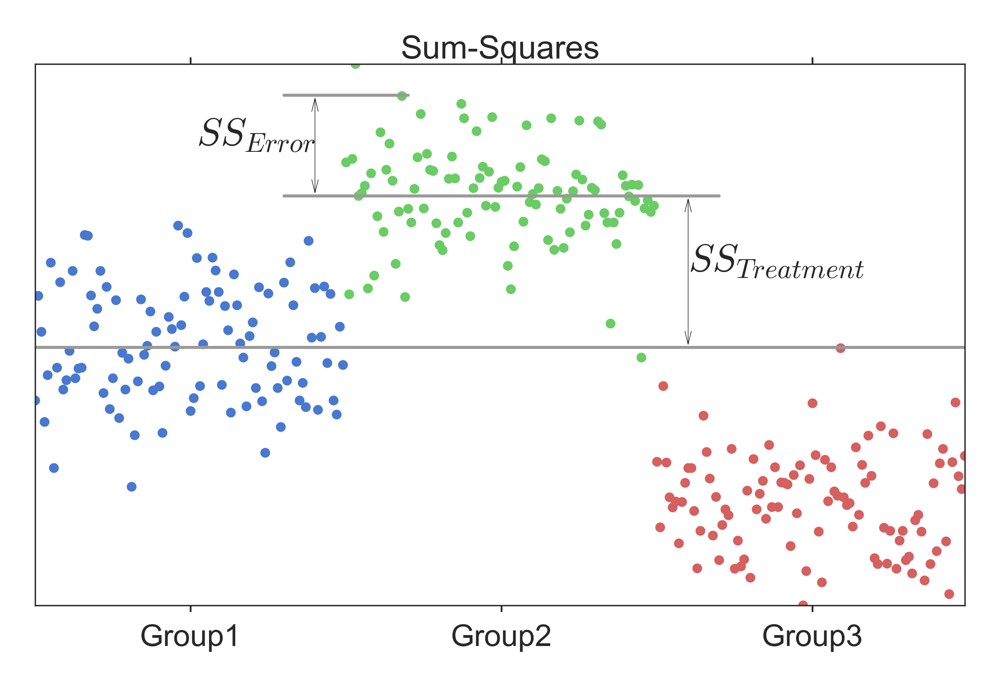

[](https://github.com/thomas-haslwanter/statsintro_python)

## [](http://quantlet.de/) **ISP_anovaOneway** [](http://quantlet.de/d3/ia)

```yaml
Name of QuantLet: ISP_anovaOneway

Published in:  An Introduction to Statistics with Python

Description: 'Analysis of Variance (ANOVA)
    - Levene test
    - ANOVA - oneway
    - Do a simple one-way ANOVA, using statsmodels
    - Show how the ANOVA can be done by hand.
    - For the comparison of two groups, a one-way ANOVA is equivalent to
      a T-test: t^2 = F'

Keywords: anova, levene test, one-way anova, t-test

See also: 'ISP_anovaTwoway, ISP_kruskalWallis,
    ISP_multipleTesting, ISP_oneGroup, ISP_twoGroups' 

Author: Thomas Haslwanter 

Submitted: October 31, 2015 

Datafile:  altman_910.txt, galton.csv

Example: anova_annotated.png
```




```py
''' Analysis of Variance (ANOVA)
- Levene test
- ANOVA - oneway
- Do a simple one-way ANOVA, using statsmodels
- Show how the ANOVA can be done by hand.
- For the comparison of two groups, a one-way ANOVA is equivalent to
  a T-test: t^2 = F
'''

# Copyright(c) 2015, Thomas Haslwanter. All rights reserved, under the CC BY-SA 4.0 International License

# Import standard packages
import numpy as np
import scipy.stats as stats
import pandas as pd

# additional packages
from statsmodels.formula.api import ols
from statsmodels.stats.anova import anova_lm


def anova_oneway():
    ''' One-way ANOVA: test if results from 3 groups are equal.
    
    Twenty-two patients undergoing cardiac bypass surgery were randomized to one of three ventilation groups:
    
    Group I: Patients received 50% nitrous oxide and 50% oxygen mixture continuously for 24 h.
    Group II: Patients received a 50% nitrous oxide and 50% oxygen mixture only dirng the operation.
    Group III: Patients received no nitrous oxide but received 35-50% oxygen for 24 h.
    
    The data show red cell folate levels for the three groups after 24h' ventilation.
    
    '''
    
    # Get the data
    print('One-way ANOVA: -----------------')
    inFile = 'altman_910.txt'
    data = np.genfromtxt(inFile, delimiter=',')
    
    # Sort them into groups, according to column 1
    group1 = data[data[:,1]==1,0]
    group2 = data[data[:,1]==2,0]
    group3 = data[data[:,1]==3,0]
    
    # --- >>> START stats <<< ---
    # First, check if the variances are equal, with the "Levene"-test
    (W,p) = stats.levene(group1, group2, group3)
    if p<0.05:
        print(('Warning: the p-value of the Levene test is <0.05: p={0}'.format(p)))
    
    # Do the one-way ANOVA
    F_statistic, pVal = stats.f_oneway(group1, group2, group3)
    # --- >>> STOP stats <<< ---
    
    # Print the results
    print('Data form Altman 910:')
    print((F_statistic, pVal))
    if pVal < 0.05:
        print('One of the groups is significantly different.')
        
    # Elegant alternative implementation, with pandas & statsmodels
    df = pd.DataFrame(data, columns=['value', 'treatment'])    
    model = ols('value ~ C(treatment)', df).fit()
    anovaResults = anova_lm(model)
    print(anovaResults)
    
    # Check if the two results are equal. If they are, there is no output
    np.testing.assert_almost_equal(F_statistic, anovaResults['F'][0])
    
    return (F_statistic, pVal) # should be (3.711335988266943, 0.043589334959179327)


#----------------------------------------------------------------------
def show_teqf():
    """Shows the equivalence of t-test and f-test, for comparing two groups"""
    
    # Get the data
    data = pd.read_csv('galton.csv')
    
    # First, calculate the F- and the T-values, ...
    F_statistic, pVal = stats.f_oneway(data['father'], data['mother'])
    t_val, pVal_t = stats.ttest_ind(data['father'], data['mother'])
    
    # ... and show that t**2 = F
    print('\nT^2 == F: ------------------------------------------')
    print(('From the t-test we get t^2={0:5.3f}, and from the F-test F={1:5.3f}'.format(t_val**2, F_statistic)))
    
    # numeric test
    np.testing.assert_almost_equal(t_val**2, F_statistic)
    
    return F_statistic


# ---------------------------------------------------------------
def anova_statsmodels():
    ''' do the ANOVA with a function '''
    
    # Get the data
    data = pd.read_csv('galton.csv')
    
    anova_results = anova_lm(ols('height ~ 1 + sex', data).fit())
    print('\nANOVA with "statsmodels" ------------------------------')
    print(anova_results)
    
    return anova_results['F'][0]


#----------------------------------------------------------------------
def anova_byHand():
    """ Calculate the ANOVA by hand. While you would normally not do that, this function shows
    how the underlying values can be calculated.
    """

     # Get the data
    inFile = 'altman_910.txt'
    data = np.genfromtxt(inFile, delimiter=',')

    # Convert them to pandas-forman and group them by their group value
    df = pd.DataFrame(data, columns=['values', 'group'])
    groups = df.groupby('group')

    # The "total sum-square" is the squared deviation from the mean
    ss_total = np.sum((df['values']-df['values'].mean())**2)
    
    # Calculate ss_treatment and  ss_error
    (ss_treatments, ss_error) = (0, 0)
    for val, group in groups:
        ss_error += sum((group['values'] - group['values'].mean())**2)
        ss_treatments += len(group) * (group['values'].mean() - df['values'].mean())**2

    df_groups = len(groups)-1
    df_residuals = len(data)-len(groups)
    F = (ss_treatments/df_groups) / (ss_error/df_residuals)
    df = stats.f(df_groups,df_residuals)
    p = df.sf(F)

    print(('ANOVA-Results: F = {0}, and p<{1}'.format(F, p)))
    
    return (F, p)
    

if __name__ == '__main__':
    anova_oneway()
    anova_byHand()
    show_teqf()
    anova_statsmodels()    
    #raw_input('Done!')
```
