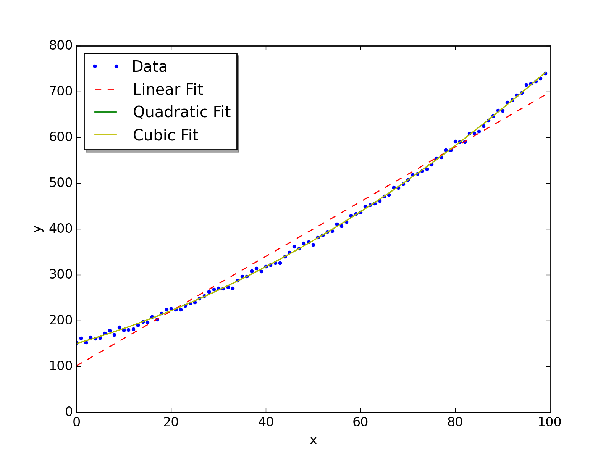

##  **ISP_modelImplementations**


```yaml
Name of QuantLet: ISP_modelImplementations

Published in:  An Introduction to Statistics with Python

Description: 'Three different ways to fit a linear model:
    - analytically
    - using the statsmodels tools
    - using the formula-based approach'

Keywords: linear regression model

See also: 'ISP_anscombe, ISP_bivariate, ISP_bootstrapDemo, ISP_fitLine, ISP_simpleModels'

Author: Thomas Haslwanter 

Submitted: October 31, 2015 

Example: linearModel.png
```





```py
''' Three different ways to fit a linear model:
- analytically
- using the statsmodels tools
- using the formula-based approach
'''

# Copyright(c) 2015, Thomas Haslwanter. All rights reserved, under the CC BY-SA 4.0 International License

# Import standard packages
import numpy as np
import matplotlib.pyplot as plt
import os

# additional packages
import sys
sys.path.append(os.path.join('..', '..', 'Utilities'))

try:
# Import formatting commands if directory "Utilities" is available
    from ISP_mystyle import showData 
    
except ImportError:
# Ensure correct performance otherwise
    def showData(*options):
        plt.show()
        return

def createData():
    ''' Generate a noisy, slightly quadratic dataset '''
    x = np.arange(100)
    y = 150 + 3*x + 0.03*x**2 + 5*np.random.randn(len(x))
    return(x,y)

def analyticalSolution(x,y):
    '''Analytical solution, using "lstsq"
    Input: x/y data
    '''
    
    # Create the Design Matrices
    M1 = np.vstack( (np.ones_like(x), x) ).T
    M2 = np.vstack( (np.ones_like(x), x, x**2) ).T
    M3 = np.vstack( (np.ones_like(x), x, x**2, x**3) ).T
    
    # an equivalent alternative solution with statsmodels would be e.g.
    # M1 = sm.add_constant(x)
    
    # Solve the equations
    p1 = np.linalg.lstsq(M1, y)
    p2 = np.linalg.lstsq(M2, y)
    p3 = np.linalg.lstsq(M3, y)
    
    # Print the results
    np.set_printoptions(precision=2)
    print('The coefficients from the linear fit: {0}'.format(p1[0]))
    print('The coefficients from the quadratic fit: {0}'.format(p2[0]))
    print('The coefficients from the cubic fit: {0}'.format(p3[0]))
    
    return (M1, M2, M3)

def smSolution(M1, M2, M3):
    '''Solution with the tools from statsmodels
    Input:  design matrices for linear quadratic, and cubic fit
    '''
    
    import statsmodels.api as sm
    
    Res1 = sm.OLS(y, M1).fit()
    Res2 = sm.OLS(y, M2).fit()
    Res3 = sm.OLS(y, M3).fit()
    
    print(Res1.summary2())
    print(Res2.summary2())
    print(Res3.summary2())
    
    # Plot the data
    plt.plot(x,y, '.', label='Data')
    plt.plot(x, Res1.fittedvalues, 'r--', label='Linear Fit')
    plt.plot(x, Res2.fittedvalues, 'g', label='Quadratic Fit')
    plt.plot(x, Res3.fittedvalues, 'y', label='Cubic Fit')
    plt.legend(loc='upper left', shadow=True)
    plt.xlabel('x')
    plt.ylabel('y')
    plt.tight_layout()
    
    showData('linearModel.png')

def smfSolution(x,y):
    '''Formula-based modeling, using the tools from statsmodels
    Input: x/y data
    '''
    
    import pandas as pd
    import statsmodels.formula.api as smf
    
    # Turn the data into a pandas DataFrame,
    # so that we can address them in the formulas with their name
    df = pd.DataFrame({'x':x, 'y':y})
    
    # Fit the models, and show the results
    Res1F = smf.ols('y~x', df).fit()
    Res2F = smf.ols('y ~ x+I(x**2)', df).fit()
    Res3F = smf.ols('y ~ x+I(x**2)+I(x**3)', df).fit()
    
    print(Res1F.summary())
    print(Res2F.summary())
    print(Res3F.summary())
    
    #Res1.conf_int()
    #Res1F.conf_int()

if __name__=='__main__':
    x,y = createData()    
    M1, M2, M3 = analyticalSolution(x, y)        
    smSolution(M1, M2, M3)    
    smfSolution(x, y)
```
