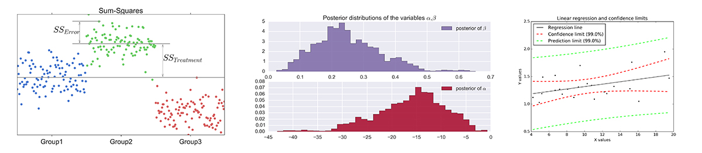

# Introduction to Statistics with Python
Almost everyone who does research needs statistics: when you have acquired
research scientific data, you typically want to use them to show that your
data provide *significant* support for some hypothesis, or if they allow to
reject that hypothesis.

The Python scripts in this repository accompany the book "Introduction to
Statistics with Python", and provide working examples of a large number of
statistical tests. So if any of those tests are required for the analysis of
your own data, you should be able to take the corresponding script, "plug
in" your own data - and you are done! The text in the book should provide
enough information so that you know what you are doing (in case you don't
know that already), and where to go next if you are looking for a more
elaborate statistical analysis of your data.

The Python sample scripts can be found in the folder *Code_Quantlets*,
and provide examples of:

- How to visualize statistical data sets.
- How to work with statistical distributions.
- Tests of mean values of one, two, or more groups of data.
- Tests on categorical data.
- Analysis of survival times and reliability data.
- Simple examples of linear regression models.
- Example of statistical bootstrapping.
- Tests on discrete data, e.g. logistic regression.
- Application of Bayesian statistics.

Additional Python scripts can be found in the following folders, sorted by
Chapter/Subchapter:

- *Figures* ... Python code for the generation of figures.
- *Listings* ... code listings that are used in the book.
- *Solutions* ... Solutions to exercises presented in the book.
