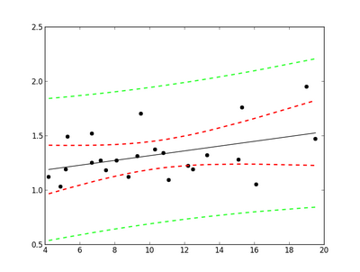

# statsintro_python
Python modules and IPython Notebooks, for the book "Introduction to Statistics With Python"

# ISP - Introduction to Statistics with Python
This folder contains
- Code samples (also called *Quantlets*)
- Solutions for the Exercises in the book
- Code-listings, i.e. Python programs printed in the book
- Code to generate the Figures in the book

# IPython Notebooks
- These notebooks are not used explicitly in the book, but also contain
  important samples and solutions to statistical applications of Python.
- Also contains a *Data* folder for data used by the IPython notebooks.

