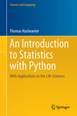

Python modules and IPython Notebooks, which accompany the book *Introduction to Statistics With Python*

This repo contains three folders: *ISP*, *ipynb*, and *ipynb_slides*

## "ISP": Introduction to Statistics with Python
All the Python programs that go with the book:
- Code samples (also called *Quantlets*)
- Solutions for the Exercises in the book
- Code-listings, i.e. Python programs printed in the book
- Code to generate the Figures in the book

## "ipynb": IPython Notebooks
- These notebooks are not used explicitly in the book, and contain
  important samples and solutions to statistical applications of Python.
- Also contains a folder for data used by the IPython notebooks.

## "ipynb_slides": Corresponding *reveal.js*-Slides
*reveal.js* is a powerful presentation application, based on CSS and HTML5.
It exists for all platforms (Windows, Linux, OSX), and has to be installed
on your computer if you want to use those slides.
- You can either create the slides yourself from the IPYNB-files, using the
  command 

    jupyter nbconvert --to slides --reveal-prefix ".." *.ipynb 

  (Note that the string after "--reveal-prefix" indicates where your
  reveal.js directories can be found.)
- Or you copy this directory (i.e. *ipynb_slides*) to the location where
  your *reveal.js* directories are, and are ready to go right away.

## Errata
The file [Errata.pdf](Errata.pdf) contains the a list of mistakes in the manuscript, and
the corresponding corrections.
